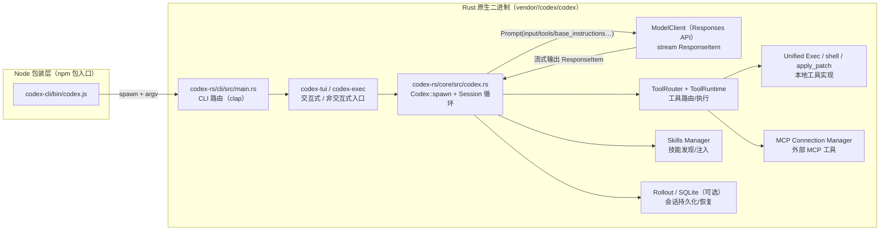
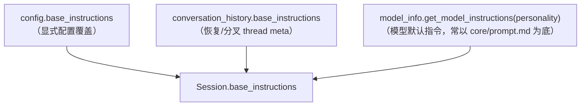
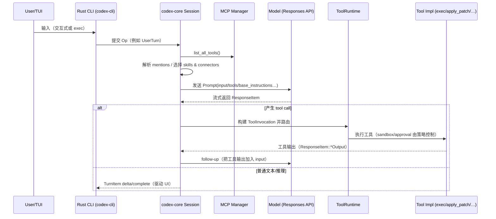
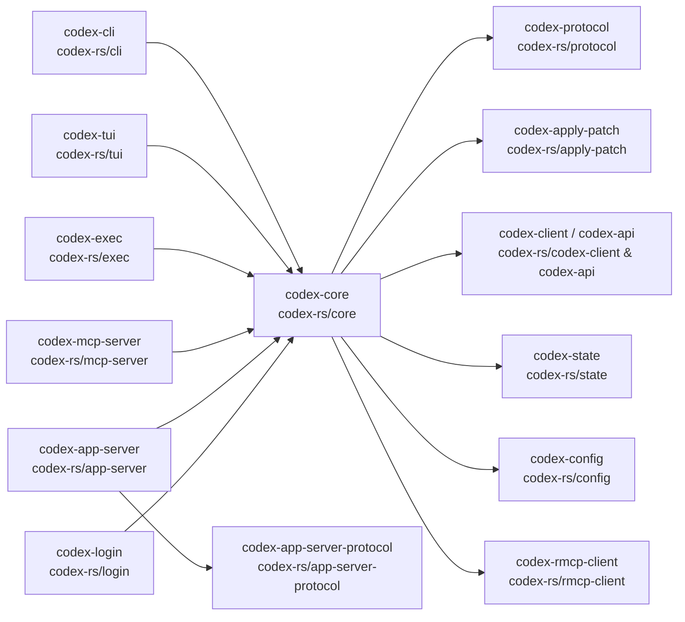
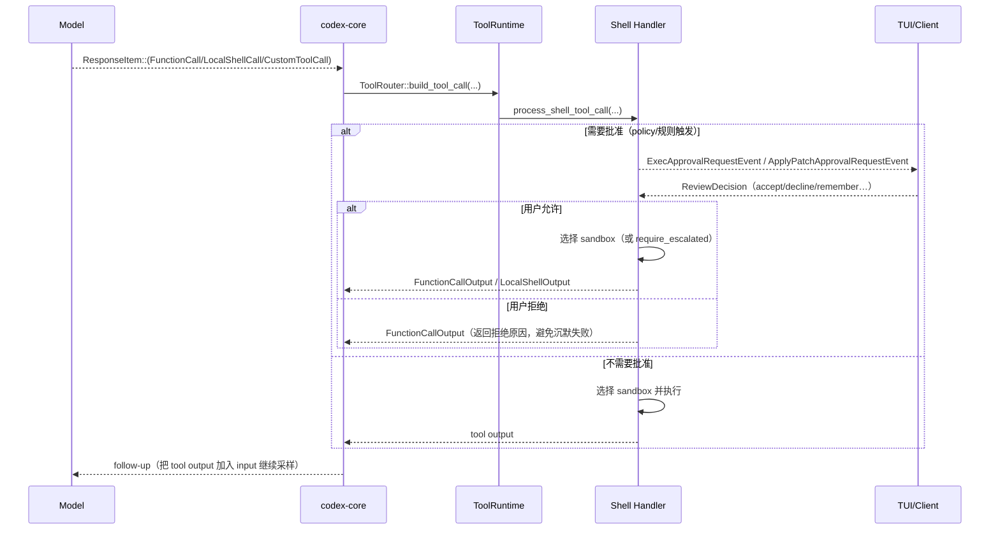
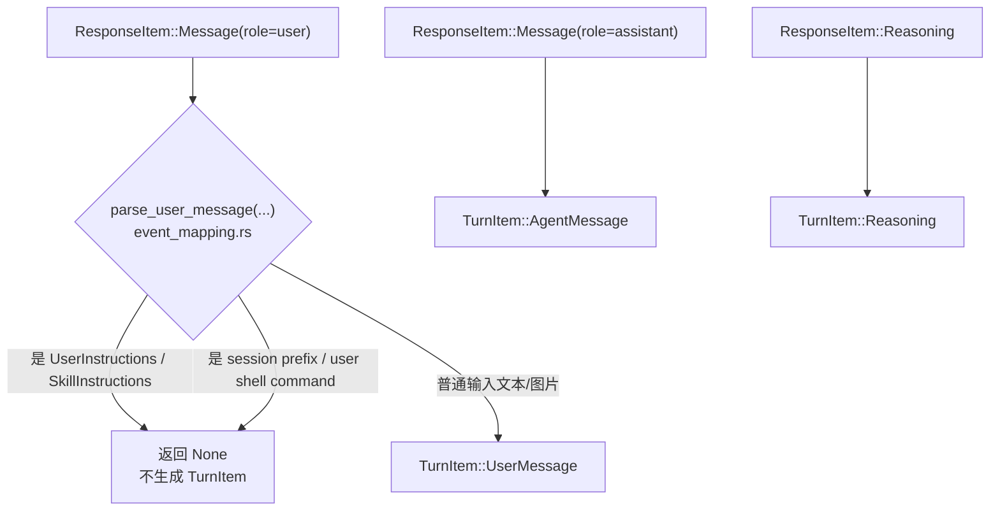
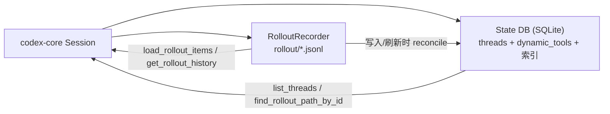
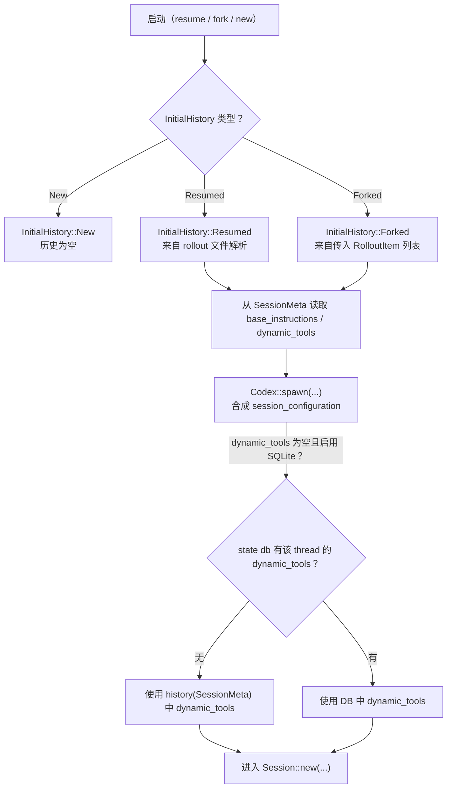

# Codex 仓库：运行链路与提示词（Prompt）组装报告

日期：2026-02-18

本文目标（面向“继续开发/排障/扩展工具”的阅读场景）：

- CLI 如何启动，以及如何定位并启动原生二进制
- 会话（Session）如何初始化：`base_instructions`、`user_instructions`、动态工具等从哪里来
- 一次 Turn 如何变成模型请求（`Prompt`），以及流式输出如何转化为工具调用并回灌上下文
- “系统提示词/指令”文本分别来自哪些文件，如何拼装与更新

说明：除非特别注明，路径均以仓库根目录为基准。

---

## 0) 总体架构（概览图）

下面这张图把“Node 包装层 → Rust CLI → core 运行时 → 模型/工具/外部扩展”串起来：



---

## 1) 入口与打包：Node 包装层 + Rust CLI

### 1.1 Node 包装层（发布版 CLI 的入口）

`codex-cli/bin/codex.js` 的职责是“选择正确平台的原生二进制并启动它”：

- 根据 `process.platform` + `process.arch` 计算 Rust target triple
- 优先解析可选平台包（例如 `@openai/codex-darwin-arm64`），并定位到其 `vendor/<triple>/codex/codex`
- 如果可选依赖缺失，则尝试使用 `codex-cli/vendor/...` 的本地 vendor
- 用异步 `spawn` 启动子进程：父进程可响应信号并转发（例如 `SIGINT`），并镜像子进程退出码

建议从这两个点读代码最快：

- `PLATFORM_PACKAGE_BY_TARGET` 以及 platform/arch 到 triple 的映射（`codex-cli/bin/codex.js`）
- `spawn(binaryPath, process.argv.slice(2), { stdio: "inherit", env })` 的运行方式与信号转发逻辑

### 1.2 Rust CLI 入口（命令行子命令分发）

Rust CLI 主入口是 `codex-rs/cli/src/main.rs`（crate 名称：`codex-cli`）。

它通过 Clap 暴露一系列子命令（示例）：

- `exec`：非交互式执行
- `review`：非交互式 code review
- `login` / `logout`：登录管理
- `mcp` / `mcp-server`：外部 MCP 服务管理/托管
- `app-server`：实验性 app server
- `apply`：把最新 diff 以 `git apply` 方式落地
- `resume` / `fork`：恢复/分叉历史会话

没有子命令时，默认进入交互式（`codex_tui`）。

---

## 2) 会话初始化：`base_instructions` 与 `user_instructions` 从哪里来

会话创建发生在 `codex-rs/core/src/codex.rs` 的 `Codex::spawn(...)`。

### 2.1 `base_instructions` 的确定逻辑（优先级）

Session 级别的 `base_instructions` 字符串按优先级取值：

1. `config.base_instructions`（显式配置覆盖）
2. `conversation_history.get_base_instructions()`（恢复/分叉时从 thread meta 取）
3. `model_info.get_model_instructions(config.personality)`（按当前 model 的默认指令）

对应代码（`codex-rs/core/src/codex.rs`）：

```rust
let base_instructions = config
    .base_instructions
    .clone()
    .or_else(|| conversation_history.get_base_instructions().map(|s| s.text))
    .unwrap_or_else(|| model_info.get_model_instructions(config.personality));
```

补充理解（容易混淆的点）：

- “模型默认指令”走的是 model 元数据路径。未知 model 的 fallback 元数据由 `codex-rs/core/src/models_manager/model_info.rs` 生成，并把 `codex-rs/core/prompt.md` 当作底座。
- 协议层（`codex-rs/protocol`）也有一个类型默认值：`codex-rs/protocol/src/prompts/base_instructions/default.md`（在 `codex-rs/protocol/src/models.rs` 里通过 `BASE_INSTRUCTIONS_DEFAULT` 引用）。它更偏“协议类型默认”，而 core 在真正启动 Session 时通常会走上面 1/2/3 这条“运行时决策链”。

### 2.2 `user_instructions`：AGENTS.md、配置、技能列表等如何汇总

`user_instructions` 由 `codex-rs/core/src/project_doc.rs` 的 `get_user_instructions(...)` 负责组装。

可能包含的来源（按拼接顺序）：

- `Config.user_instructions`（用户配置中的文本）
- Project docs：默认扫描 `AGENTS.md`，也支持 fallback 文件名；从 git root 到当前工作目录（root → cwd）逐级拼接
- JS REPL 说明（feature gate）
- Skills 列表 section（当启用技能并把 skills 传入时）
- 分层 AGENTS 说明（feature gate）

要点：

- 查找/拼接规则写在 `codex-rs/core/src/project_doc.rs` 的模块注释与 `discover_project_doc_paths(...)` 中
- 当既有 `Config.user_instructions` 又有 project docs 时，中间会插入 `--- project-doc ---` 分隔符

### 2.3 `base_instructions` 的“来源层级图”

把 2.1 的优先级用图表示如下（越靠上优先级越高）：



### 2.4 动态工具（dynamic tools）如何进入 Session

动态工具主要解决两类场景：

- “线程启动时就固定的一组额外工具”（例如由 UI 或上层协议注入）
- “恢复/分叉线程时，需要把之前的动态工具一起带回来”

在 `Codex::spawn(...)` 里有一个关键逻辑（`codex-rs/core/src/codex.rs`）：

- 如果本次启动没有显式传入 `dynamic_tools` 且启用了 SQLite 功能，则尝试从 state db 读取该 thread 的动态工具
- 如果 state db 没有，则再从 `conversation_history.get_dynamic_tools()` 取（用于 resume/fork 的 history meta）
- 都没有则为空

对应代码形态（缩写版，便于理解）：

```rust
let persisted_tools = if dynamic_tools.is_empty() && config.features.enabled(Feature::Sqlite) {
    // state_db::get_dynamic_tools(...)
    ...
} else {
    None
};
let dynamic_tools = if dynamic_tools.is_empty() {
    persisted_tools
        .or_else(|| conversation_history.get_dynamic_tools())
        .unwrap_or_default()
} else {
    dynamic_tools
};
```

这一段是定位“为什么我添加/删除了 dynamic tool 但在恢复线程后不一致”的最佳入口。

---

## 3) Turn 执行链路：从用户输入到模型 `Prompt`，再到工具调用

### 3.1 一次 Turn 的宏观步骤

可以把一次 Turn 视为：

1. 收集给模型看的输入 items（历史 + 本次用户消息 + 注入的 skill items + 其它 session prefix）
2. 计算本次 Turn 的可用工具集合（builtins + MCP + Apps connectors + dynamic tools）
3. 构造 `Prompt` 并发起模型请求
4. 流式处理返回的 `ResponseItem`：普通文本/推理 → UI 事件；工具调用 → 路由执行并回灌输出

### 3.2 `Prompt` 的结构（模型请求载体）

模型请求载体 `Prompt` 定义在 `codex-rs/core/src/client_common.rs`：

```rust
pub struct Prompt {
    pub input: Vec<ResponseItem>,
    pub(crate) tools: Vec<ToolSpec>,
    pub(crate) parallel_tool_calls: bool,
    pub base_instructions: BaseInstructions,
    pub personality: Option<Personality>,
    pub output_schema: Option<Value>,
}
```

理解它的关键点：

- 模型看到的上下文不是“纯字符串历史”，而是一组结构化的 `ResponseItem`（消息、工具调用、工具输出等）。
- “系统提示词等价物”在这里主要表现为 `base_instructions`；此外，`input` 中也可能包含 developer/user role 的说明性消息（例如 model switch/personality update 等）。

### 3.3 架构时序图：一次 Turn 如何跑起来

这张时序图用“最常见路径”把请求/流式/工具回灌串起来：



### 3.4 `Prompt` 的构造位置（核心代码锚点）

在 `codex-rs/core/src/codex.rs` 的 `run_sampling_request(...)` 中，核心逻辑是：

1. 通过 `built_tools(...)` 计算工具路由（包含 MCP / Apps / 动态工具等）
2. 对路由 specs 做 model 过滤：`filter_tools_for_model(...)`
3. 取 session 的 `base_instructions`
4. 构造 `Prompt` 并进入 `try_run_sampling_request(...)`（带重试/transport fallback）

对应片段（位置见 `run_sampling_request(...)` 附近）：

```rust
let tools =
    crate::tools::spec::filter_tools_for_model(router.specs(), &turn_context.tools_config);
let base_instructions = sess.get_base_instructions().await;

let prompt = Prompt {
    input,
    tools,
    parallel_tool_calls: model_supports_parallel,
    base_instructions,
    personality: turn_context.personality,
    output_schema: turn_context.final_output_json_schema.clone(),
};
```

### 3.5 流式输出如何变成“工具调用/普通消息”

流式处理在 `codex-rs/core/src/stream_events_utils.rs` 里有清晰入口：

- `handle_output_item_done(...)`：对每个 `ResponseItem` 做分类
  - 先尝试由 `ToolRouter::build_tool_call(...)` 识别为工具调用
  - 如果是工具调用：立即持久化该 item，然后交给 tool runtime 异步执行
  - 否则：把内容转换为 UI/历史里的正常 assistant item（或推理片段）

---

## 4) 工具系统：builtins、MCP、Apps、dynamic tools 如何合并

### 4.1 `built_tools(...)` 的职责（工具集合的“组装点”）

`codex-rs/core/src/codex.rs` 的 `built_tools(...)` 做了这些事情：

- 读取 MCP 工具列表（如果存在已配置 server）
- 如果启用 Apps feature：
  - 从 MCP 工具推导 connectors
  - 根据输入中的 mentions 判断本次 Turn “显式启用”的 connector
  - 过滤 Apps MCP server 下允许暴露给模型的工具
- 应用 session 内部的 MCP tool selection（如果 UI/上层缩小了工具集合）
- 把工具汇总到 `ToolRouter::from_config(...)`：
  - builtin tools（由 `turn_context.tools_config` 控制）
  - MCP tools（过滤后）
  - Apps tools（过滤后）
  - dynamic tools（来自 `thread/start` 或持久化恢复）

### 4.2 工具路由/执行的分层理解图

```mermaid
flowchart TB
  A["Turn 输入 ResponseItem[]"] --> B["built_tools(...) 组装 ToolRouter"]
  B --> C["ToolRouter.specs() -> ToolSpec[]"]
  C --> D["filter_tools_for_model(...)"]
  D --> E["Prompt.tools"]

  subgraph Runtime["运行时执行路径"]
    R1["stream ResponseItem"] --> R2["ToolRouter::build_tool_call(...)"]
    R2 -->|Some(call)| R3["ToolRuntime.handle_tool_call(...)"]
    R3 --> R4["具体 handler：shell/apply_patch/… 或 MCP"]
    R4 --> R5["记录 tool output 到 history，并触发 follow-up"]
  end
```

---

## 5) 技能（Skills）：如何被发现、如何被显式提及、如何注入 Prompt

### 5.1 提及方式（让某个 skill 生效）

技能选择与注入逻辑在 `codex-rs/core/src/skills/injection.rs`：

- 结构化选择：`UserInput::Skill { name, path }`
- 文本提及：`$skill-name`
- 链接式提及：`[$skill-name](skill://path/to/SKILL.md)`（同时记录 name 与 path，用于更稳定的匹配）

核心流程是：

1. 从输入里提取 mentions（names/paths/plain_names）
2. 在已加载 skills 中选择“明确无歧义”的 skill
3. 读取 skill 文件内容，把它包装成一个 `ResponseItem::Message`（role=`user`，带 `<skill>...</skill>` 标签）

把 `SkillInstructions` 转成 `ResponseItem` 的格式定义在：

- `codex-rs/core/src/instructions/user_instructions.rs`（`From<SkillInstructions> for ResponseItem`）

### 5.2 技能发现（skills roots 的来源）

skills 的扫描与元数据解析在 `codex-rs/core/src/skills/loader.rs`。

它会从多个 roots 扫描 `SKILL.md`（例如）：

- `$CODEX_HOME/skills`（历史兼容路径）
- `$HOME/.agents/skills`（用户安装 skills）
- repo/config layer 对应的 skills 目录（以及 system/admin 等 scope）

并且对 scope 进行排序与去重，使得同名/同 path 的技能有明确优先级。

### 5.3 注入发生在 Turn 开始阶段（在采样前）

在 `codex-rs/core/src/codex.rs` 的 Turn 启动路径里：

- 先 `build_skill_injections(...)` 读取被选中的 `SKILL.md`
- 产生 `skill_items`（`ResponseItem` 列表）后写入历史：`record_conversation_items(...)`
- 同时对读取失败等问题以 warning event 方式发给前端

这意味着：模型在本次采样时就能看到 skill 的内容（作为 user role 的 message）。

---

## 6) 提示词/指令来源：哪些文件会进入模型上下文，如何更新

这一节回答“系统提示词到底在哪”以及“为什么我改了某个文件不生效”的常见问题。

### 6.1 Core 底座提示词：`codex-rs/core/prompt.md`

`codex-rs/core/prompt.md` 是 core 的“底座”提示词文本（包含身份、AGENTS 规则、输出格式等）。

它通过 `codex-rs/core/src/models_manager/model_info.rs` 的 fallback model metadata 路径被引用（unknown model 或某些本地构造的模型元数据会把它当作 base text）。

### 6.2 Model 元数据的 instructions template（含 personality 占位符）

`codex-rs/core/src/models_manager/model_info.rs` 里对某些 slug（例如 `gpt-5.2-codex`）构造了一个 `ModelMessages`：

- `instructions_template` 中包含 `{{ personality }}`
- `instructions_variables` 提供 `friendly/pragmatic/...` 的短文本片段

注意：这条路径与 `codex-rs/core/templates/model_instructions/gpt-5.2-codex_instructions_template.md` 的存在并不等价；实际运行时默认从 model metadata 的 `instructions_template` 取指令文本，然后按 personality 做替换。

当模型切换或 personality 变化时，core 可以插入 developer 消息进行更新（见）：

- `codex-rs/core/src/context_manager/updates.rs`
  - `build_model_instructions_update_item(...)`
  - `build_personality_update_item(...)`

### 6.3 Protocol 层的默认指令与权限提示

在 `codex-rs/protocol/src/models.rs`：

- `BASE_INSTRUCTIONS_DEFAULT` 来自 `codex-rs/protocol/src/prompts/base_instructions/default.md`
- approval policy 的提示来自 `codex-rs/protocol/src/prompts/permissions/approval_policy/*.md`
- sandbox mode 的提示来自 `codex-rs/protocol/src/prompts/permissions/sandbox_mode/*.md`

这部分更偏协议侧“可序列化/可传输”的默认文本与策略说明。

### 6.4 `apply_patch` 的专用指令与输入格式敏感性

`apply_patch` 有独立的指令包：

- `codex-rs/apply-patch/src/lib.rs`：导出 `APPLY_PATCH_TOOL_INSTRUCTIONS`
- `codex-rs/apply-patch/apply_patch_tool_instructions.md`：指令正文

此外，core 在 `codex-rs/core/src/client_common.rs` 的 `Prompt::get_formatted_input()` 中做了一个关键兼容逻辑：

- 当本次 `Prompt.tools` 中存在 Freeform/custom `apply_patch` 时，会把 shell 输出重新序列化为“结构化文本”，以符合该工具的输入/回显预期。

### 6.5 自定义 prompts（类似 slash 命令的素材库）

`codex-rs/core/src/custom_prompts.rs` 会从 `$CODEX_HOME/prompts` 扫描用户自定义 `.md`：

- 只收集 `.md`
- 支持用 `---` 包裹的轻量 frontmatter（例如 `description` / `argument-hint`）

---

## 7) 排障索引：想看某个行为，最快从哪里开始

按“你要追的现象”给出定位锚点：

- Session 初始化与 base instructions：`codex-rs/core/src/codex.rs`（`Codex::spawn`）
- AGENTS.md / user_instructions 拼接：`codex-rs/core/src/project_doc.rs`
- Prompt 结构与输入格式化：`codex-rs/core/src/client_common.rs`
- Turn 采样与工具组装：`codex-rs/core/src/codex.rs`（`run_sampling_request`、`built_tools`）
- 流式 item 分类（工具 vs 普通输出）：`codex-rs/core/src/stream_events_utils.rs`
- 技能提及解析与注入：`codex-rs/core/src/skills/injection.rs`
- 技能扫描 roots 与解析：`codex-rs/core/src/skills/loader.rs`
- apply_patch 指令来源：`codex-rs/apply-patch/src/lib.rs`、`codex-rs/apply-patch/apply_patch_tool_instructions.md`
- app-server 协议示例：`codex-rs/app-server/README.md`

---

## 8) crate 级依赖与模块边界（推荐的“分层心智模型”）

如果你要在仓库里做功能扩展/排障，按 crate 分层理解会很省时间。下面图里的箭头含义是“左侧 crate 依赖右侧 crate”（粗粒度，省略了大量 utils/crates 细节）。



这张图对应的“职责边界”可以这样记：

- `codex-cli`：命令行入口/子命令路由（不做核心逻辑）
- `codex-tui`：交互式 UI，主要通过 core 暴露的事件流驱动界面
- `codex-core`：真正的运行时（Session、Turn、Prompt、tools、skills、持久化、策略等）
- `codex-protocol`：跨进程/跨语言的协议类型（`ResponseItem`、config types、prompts 默认文本等）
- `codex-apply-patch`：`apply_patch` 的工具协议与严格 patch 语法说明
- `codex-app-server(-protocol)`：app-server v2 协议与服务实现

---

## 9) 权限/沙箱/审批：工具调用是如何被“拦截/放行/拒绝”的

从链路上看，审批与沙箱不是“外层 UI 功能”，而是 core 工具运行时的一部分：

- `Codex::spawn(...)` 会加载 exec policy 规则：`ExecPolicyManager::load(&config.config_layer_stack)`（`codex-rs/core/src/codex.rs`）
- shell 相关工具 handler 在执行前会根据：
  - `SandboxPolicy`（配置决定：danger/full access/external/…）
  - `AskForApproval`（approval policy，on-request / never / …）
  - 规则匹配（允许列表/禁止列表）
  - 以及工具种类（builtin / mcp / custom / local shell）
  来决定“直接执行、向用户请求批准、或直接拒绝并返回给模型”

### 9.1 典型审批时序（以 shell 类工具为例）



### 9.2 审批提示词文本来自哪里

approval/sandbox 的提示词不是写死在 handler 里，而是来自 protocol 的 prompts 目录（用于指导模型如何“请求批准/解释原因”）：

- `codex-rs/protocol/src/prompts/permissions/approval_policy/*.md`
  - 例如 `on_request_rule.md` 定义了如何请求 `require_escalated` 等关键约定
- `codex-rs/protocol/src/prompts/permissions/sandbox_mode/*.md`

同时，MCP 工具调用还会走额外的审批/元数据路径（例如 connector/tool title 等）：

- `codex-rs/core/src/mcp_tool_call.rs`

---

## 10) ResponseItem → TurnItem → Event：UI 为什么“看得到/看不到”某些内容

`codex-core` 里有两条并行但相关的“数据管道”：

1. **模型上下文管道**：以 `ResponseItem` 为单位记录进历史，用于下一轮 Prompt 的 `input`
2. **UI 展示管道**：把某些 `ResponseItem` 映射成更面向前端的 `TurnItem` / Event（例如用户消息、助手消息、推理摘要、web search）

### 10.1 映射入口：`parse_turn_item(...)`

`codex-rs/core/src/event_mapping.rs` 的 `parse_turn_item(...)` 是最直接的阅读点：

- `ResponseItem::Message`：
  - `role="user"`：解析为 `TurnItem::UserMessage`（但会跳过 session prefix、user shell command、以及技能/用户指令标签内容）
  - `role="assistant"`：解析为 `TurnItem::AgentMessage`
  - `role="system"`：直接忽略（UI 不展示）
- `ResponseItem::Reasoning`：映射为 `TurnItem::Reasoning`
- `ResponseItem::WebSearchCall`：映射为 `TurnItem::WebSearch`
- 其它类型默认返回 `None`（例如大量 tool items 不是以 TurnItem 形式展示，而是以更专门的事件/面板渲染）

### 10.2 数据流图：为什么技能/前缀不会显示成普通用户消息



排障时的常见结论：

- 你在 Prompt 里“确实注入了 skill 内容”，但 UI 的用户消息列表可能看不到它：因为 `parse_user_message(...)` 会过滤掉 skill/user-instructions 类型的消息（它们更像“系统输入材料”，而不是“用户对话文本”）。
- 你在模型输出里看到了一些 system role 的内容，但 UI 不展示：因为 system role 被直接忽略。

---

## 11) 持久化与恢复：rollout（jsonl）+ SQLite state db 的协作关系

这一章解决三类问题：

- “会话历史到底存在哪里？”（文件？DB？两者都有？）
- “resume/fork 时，为什么 base_instructions/dynamic_tools 能/不能恢复？”
- “为什么有些事件/输出不会被持久化？”（与 `EventPersistenceMode` 有关）

### 11.1 两套存储：rollout 文件 vs SQLite state db（定位与职责）

在 core 里，持久化通常是两条线并行：

- **rollout 文件（`.jsonl`）**：完整的 session 记录流（可回放、可审计、可导出）。实现主要在 `codex-rs/core/src/rollout/recorder.rs`。
- **SQLite state db**：为“列表/检索/快速定位线程元数据”服务的索引型存储（例如 thread 列表、rollout_path、部分摘要字段、dynamic_tools 等）。实现封装在 `codex-rs/core/src/state_db.rs`，底层是 `codex-state`。

可以用下图理解两者关系：



### 11.2 初始历史载体：`InitialHistory`（New / Resumed / Forked）

协议层定义了启动时携带的历史类型（`codex-rs/protocol/src/protocol.rs`）：

- `InitialHistory::New`：全新会话（没有历史 items）
- `InitialHistory::Resumed(ResumedHistory)`：从某个 rollout 文件恢复（带 `conversation_id`、`history`、`rollout_path`）
- `InitialHistory::Forked(Vec<RolloutItem>)`：从一段历史 items 分叉出新线程

`InitialHistory` 还提供了几个会在 `Codex::spawn(...)` 用到的“元数据读取器”：

- `get_base_instructions()`：从 `RolloutItem::SessionMeta` 里取 `base_instructions`
- `get_dynamic_tools()`：从 `RolloutItem::SessionMeta` 里取 `dynamic_tools`
- `forked_from_id()` / `session_cwd()`：辅助 UI/恢复逻辑

### 11.3 SessionMeta 是“恢复关键”：base_instructions 与 dynamic_tools 都从这里来

rollout 文件头部会写入 `SessionMeta`（`RolloutItem::SessionMeta`），它包含：

- thread id（`id`）与 `forked_from_id`
- `cwd`、`source`、`model_provider` 等环境信息
- **`base_instructions`**（Option）
- **`dynamic_tools`**（Option，空集合时写 None）

写入位置在 `RolloutRecorder::new(...)`（`codex-rs/core/src/rollout/recorder.rs`）的 Create 分支里构造 `SessionMeta`，随后在 `persist()` 时 materialize 文件并把 meta 写入。

### 11.4 “延迟落盘”：为什么新会话一开始可能没有 rollout 文件

`RolloutRecorder` 的设计是：**新会话先预计算路径与 SessionMeta，但不立刻创建文件**。只有在显式 `persist()` 之后才 materialize。

代码注释在 `RolloutRecorder::new(...)` 里写得很直接（`codex-rs/core/src/rollout/recorder.rs`）：

- Create：defer file creation/open，直到 `persist()`
- Resume：立即打开已有文件并 append

这对排障很重要：如果你在“会话刚启动但还没触发 persist”阶段去找 `~/.codex/sessions/rollout-*.jsonl`，可能会误以为没写入。

### 11.5 state db 的“读路径”：查找 thread、rollout_path、dynamic_tools

`codex-rs/core/src/state_db.rs` 提供了几类读 API：

- `list_threads_with_db_fallback(...)`（由 `RolloutRecorder::list_threads` 间接使用）：优先走 DB 列表，并对 stale rollout_path 做清理
- `find_rollout_path_by_id(...)`：用 thread id 找对应 rollout path
- `get_dynamic_tools(...)`：用 thread id 找 dynamic tools

核心定位点：

- `get_dynamic_tools(...)`：`codex-rs/core/src/state_db.rs`

### 11.6 state db 的“写路径”：reconcile_rollout 与 persist_dynamic_tools

state db 的写入通常不是“每个事件都单独写 DB”，而是借助 reconcile：

- rollout writer 在写入 items 后调用 reconcile，把结构化元数据 upsert 到 DB（用于 thread 列表/索引）
- `reconcile_rollout(...)` 在必要时会从 rollout 文件里抽取 metadata，并把 `SessionMeta.dynamic_tools` 同步进 DB（`persist_dynamic_tools(...)`）

关键代码入口：

- `reconcile_rollout(...)`：`codex-rs/core/src/state_db.rs`
- `persist_dynamic_tools(...)`：`codex-rs/core/src/state_db.rs`

### 11.7 持久化策略：`EventPersistenceMode`（为什么有些事件没写进文件）

rollout 并非“无条件写入所有东西”，它由 `EventPersistenceMode` 控制（`codex-rs/core/src/rollout/policy.rs`）：

- `Limited`：默认，持久化更克制（避免泄露/体积膨胀）
- `Extended`：更详细，但仍会对某些大字段做截断/清理（例如 exec 的输出会截断到 bounded summary）

在 `RolloutRecorder::record_items(...)` 中，真正写入前会调用：

- `is_persisted_response_item(item, mode)`：决定要不要写
- `sanitize_rollout_item_for_persistence(item, mode)`：Extended 下会对某些事件做裁剪（例如保留 `aggregated_output`，清空 stdout/stderr/formatted_output）

### 11.8 恢复链路总图：resume/fork 如何决定“历史从哪来”

把恢复时的几条 fallback 画成图如下：



实用结论（排障手册式）：

- **dynamic tools 不见了**：优先检查 `SessionMeta.dynamic_tools` 是否写入（rollout 里第一条 `session_meta`），再检查 state db 是否落库（`persist_dynamic_tools`/`reconcile_rollout`）。
- **base_instructions 不符合预期**：按 2.1 优先级看，resume/fork 场景下 `InitialHistory.get_base_instructions()` 可能会覆盖 model 默认值。
